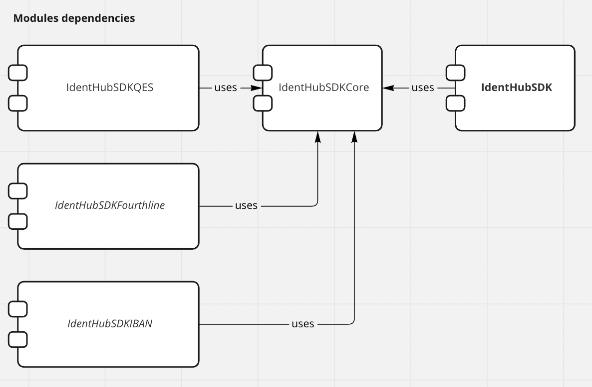
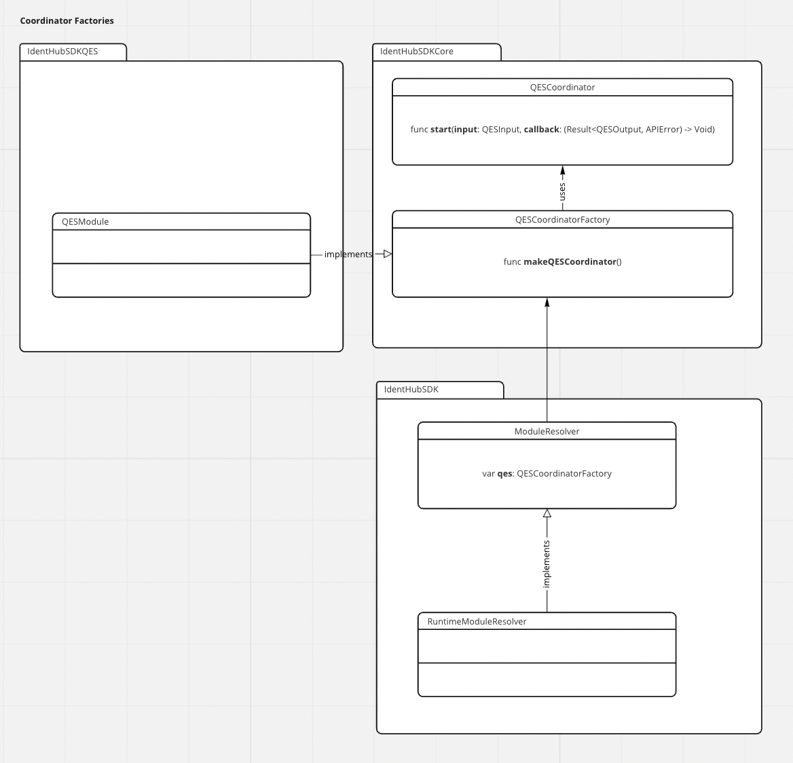
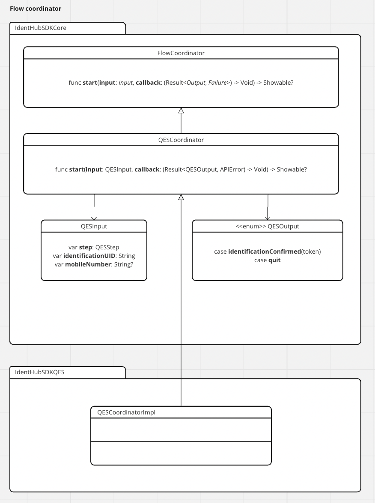
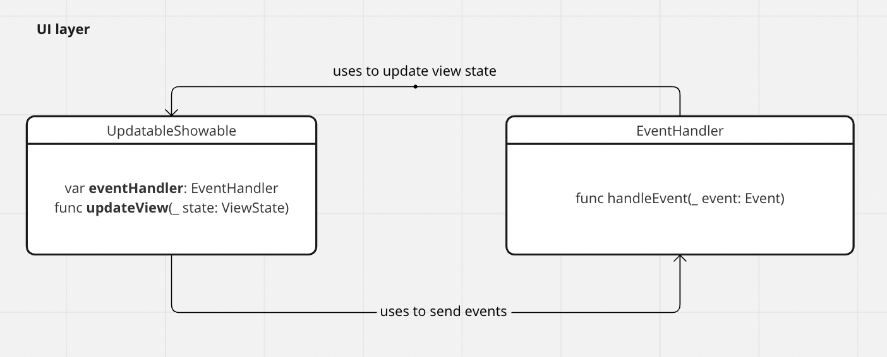

# IdentHub SDK Architecture Overview

- [Modules](#modules)
- [Coordinators](#coordinators)
- [UI layer](#ui-layer)
- [Testing](#testing)

## Modules
SDK has modular structure that allows to include into a project only modules related to supported identification flows.

Modules:

* **IdentHubSDK** (main module) - required module that provides public SDK interfaces and main identification flow handling, uses optional modules to perform parts of the flow
* **IdentHubSDKCore** module - required module that contains shared components and optional modules interfaces (the only dependency of other modules)
* Optional modules - realize parts of the flow (**IdentHubSDKQES**, *Fourthline*, *IBAN*)

At the moment the only optional module is **IdentHubSDKQES**. *Fourthline* and *IBAN* modules are for now still part of the main module.

Each module has it's corresponding XCode project and a podspec specification.

The modules are independent from each other (on compilation level) except the dependency to the Core module.

### Main module
Main module provides public SDK interfaces and coordinates identification flows handling. It uses optional modules (resolved in the runtime) to perform parts of the flow.

#### Module resolver
Main module uses RuntimeModuleResolver to resolve modules during runtime. It uses coordinator factory interfaces (defined in the IdentHubSDKCore module) to interact with the optional modules.

### Core module
Core module contains:

* interfaces for optional modules
* shared components and shared extensions

### Optional flow modules
These modules are independent from each other. The only module they relay on is the Core module.

Each optional flow module provides a FlowCoordinator implementation that performs a part of the identification flow.

## Flow coordinators
A flow coordinator performs a part of the flow. All necessary information a coordinator receives as part of it's input. After the part of the flow is executed a flow coordinator returns asynchronously it's result.

A flow coordinator can produce a view controller that needs to be added to the view hierarchy by it's caller.

## UI layer
The UI is built from UIViewControllers conforming to UpdatableShowable protocol. Each UIViewController is using it's dedicated EventHandler that performs business logic. Each UIViewController has 
also it's ViewState that contains all the data that it needs to display the UI.

EventHandlers are handling events from the UI, perform business logic and update UIViewControllers state.

## Testing

We have several types of tests in the SDK

* unit tests
* flow tests (testing parts of the flow in optional modules)
* snapshot tests (testing view controllers)

The snapshot tests needs to be run on a specific version and model of the iPhone simulator.

Currently snapshot tests are using **iPhone 12 (IOS 15.2)**.

## References
[Diagrams](https://miro.com/app/board/uXjVPcSBpCU=/)